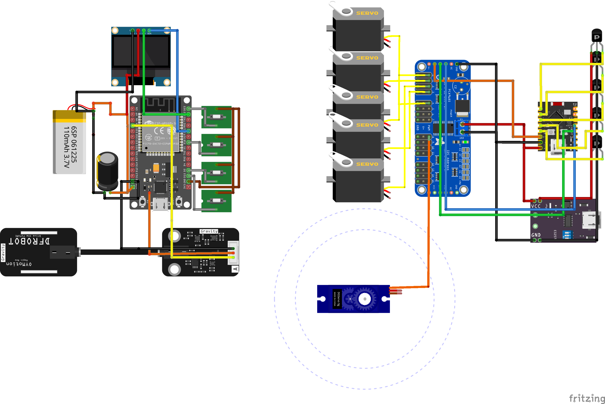

# Prótese Mioelétrica de Mão (TCC)

Este repositório contém os códigos fonte e documentação para o desenvolvimento de uma prótese de mão mioelétrica de baixo custo. O projeto combina modelagem 3D baseada em projetos open-source consagrados com um sistema de controle eletrônico customizado dividido em dois módulos via comunicação sem fio.

## 📋 Sobre o Projeto

O objetivo deste projeto é capturar sinais musculares (EMG) do usuário e transformá-los em movimentos precisos de abertura e fechamento da mão robótica. O sistema foi projetado para ser modular, separando a aquisição de dados do controle dos motores.

### Arquitetura do Sistema

O projeto é dividido em duas partes principais que se comunicam via protocolo **ESP-NOW**:

1. **EMG Box (Transmissor):** Responsável pela leitura dos sinais musculares e interface com o usuário.
2. **Controlador da Mão (Receptor):** Responsável por receber os comandos e acionar os servomotores da prótese.

## 🛠️ Hardware e Eletrônica

### 1. EMG Box (Processamento e Interface)

Este módulo é o "cérebro" de aquisição. Ele lê o sensor muscular, processa o sinal para decidir entre os estados de **Mão Aberta** ou **Mão Fechada** e envia o comando via WiFi.

* **Microcontrolador:** ESP32 DevKit V1
* **Funcionalidades:**
  * Leitura do sensor EMG.
  * **Menu Interativo:** Conta com um display OLED/LCD (verificar tipo no código) que permite ao usuário configurar parâmetros de sensibilidade e visualizar o status do sistema em tempo real.
  * Envio de pacotes via ESP-NOW.

### 2. Controlador da Mão (Atuadores)

Este módulo fica embarcado na própria estrutura da mão ou antebraço, recebendo os sinais e movendo os dedos.

* **Microcontrolador:** ESP32-C3 SuperMini (pelo seu tamanho reduzido e eficiência).
* **Funcionalidades:**
  * Recepção de comandos via ESP-NOW.
  * Controle PWM dos servomotores (via I2C ou direto, conforme implementação `esp32_i2cservo`).

### ⚡ Diagrama Elétrico

O esquema de ligação detalhado para ambos os módulos pode ser visualizado abaixo:



## 🖨️ Design Mecânico e Peças 3D

A estrutura mecânica é uma hibridização de projetos renomados com adaptações personalizadas para acomodar a eletrônica e melhorar a funcionalidade.


### Referências Base

* **InMoov Hand:** A base do design dos dedos e palma. [Visite o projeto oficial](https://inmoov.fr/inmoov-hand/).
* **Capobussi Design:** Utilizado como referência para mecanismos e adaptações do antebraço. [Ver no Thingiverse](https://www.thingiverse.com/thing:3771283).

### 🌟 Peças Customizadas

Para tornar este projeto viável com o hardware escolhido (especialmente o ESP32-C3 SuperMini e o sistema de baterias), foram modeladas peças exclusivas:

* *Adaptador para união dos modelos 3D.*
* Ponteiras modifcadas para material flexivel.
* Caixa para acomodar o sensor emg juntamente do controlador, botões e tela.
* *As peças customizadas estão disponíveis na pasta `assets/3D_Models` deste repositório.*

## 📡 Comunicação (ESP-NOW)

A comunicação entre a **EMG Box** e a **Mão** utiliza o protocolo **ESP-NOW** da Espressif. Isso garante:

* Baixa latência (resposta rápida aos movimentos musculares).
* Conexão direta sem necessidade de roteador WiFi.
* Baixo consumo de energia.

O `EMG_BOX` atua como **Controller (Master)**, enviando a decisão de movimento, enquanto o `ESP32_C3` atua como **Peripheral (Slave)**, executando a ação motora.

## 🚀 Como Utilizar

1. **Upload dos Códigos:**
   * Carregue o código da pasta `EMG_BOX` no ESP32 DevKit V1.
   * Carregue o código da pasta ESP32_I2CServo no ESP32-C3 SuperMini.
   * *Nota: Certifique-se de atualizar o endereço MAC do receptor no código do transmissor.*
2. **Calibração:**
   * Ligue a EMG Box.
   * Utilize o **Menu no Display** para ajustar o limiar (threshold) do sensor EMG conforme a força muscular do usuário.
3. **Operação:**
   * Ao contrair o músculo, o sistema detectará o pico de sinal e enviará o comando de fechar/abrir a mão.

## 📂 Estrutura de Arquivos

```bash
├── EMG_BOX/              # Código fonte para o ESP32 DevKit V1
├── ESP32_I2CServo/         # Código fonte para o ESP32-C3 SuperMini
├── assets/3D_Models/            # Arquivos STL (Customizados e Modificados)
├── assets/DIAGRAMAS                 # Diagramas elétricos e documentação
└── README.md
```
